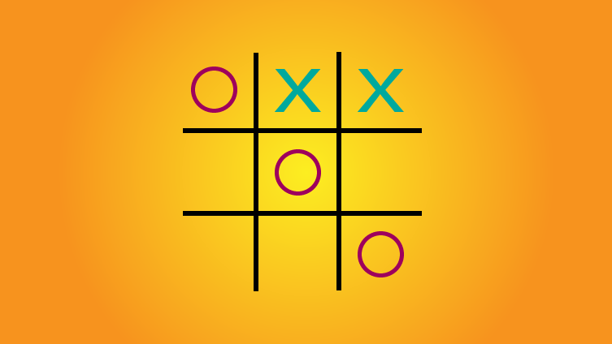
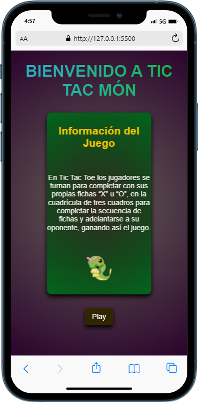
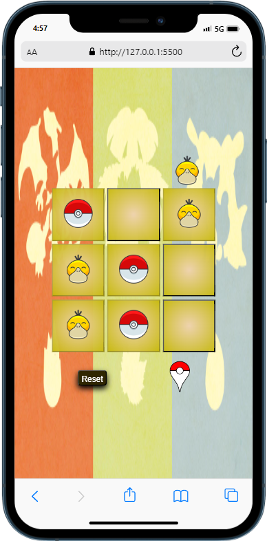

  

<h3 align="center">Proyecto Tic Tac Toe</h3>

---

 Few lines describing your project.
      

## 📝 Table of Contents

- [About](#about)
- [Demo](https://cesarparada.github.io/Proyecto-Tic-Tac-Toe/)
- [Preview](#Preview)
- [Getting Started](#getting_started)
- [Authors](#authors)
- [Contact](#contact)
- [Acknowledgments](#acknowledgement)

## 🧐 About 

Se realizo diseño del clasico juego Tic Tac Toe en un proyecto digital adaptado a formato mobile first, con distinta vistas aplicando SPA y manipulaciòn del DOM

## 🏁 Getting Started 

Empiezas en la página principal donde tienes algo de información del juego, luego de presionar play te aparecerá una ventana para seleccionar el modo de juego, posteriormente ingresarás a una nueva ventana donde colocarás tu nombre y el de tu oponente, luego se jugará por turnos que se indicarán en la parte superior del tablero, se colocarán fichas para intentar hacer una combinación ganadora que redirigirá a la vista de Ganador.

## Preview

vista Inicio.

Vista Tablero de Juego.

Vista Ganador.

Vista Empate.

Video demostración.

## ⛏️ Built Using 

- [JavaScript](https://developer.mozilla.org/es/docs/Web/JavaScript)
- [CSS](https://developer.mozilla.org/es/docs/Web/CSS)
- [HTLM5](https://developer.mozilla.org/es/docs/Glossary/HTML5)

## ✍️ Authors 

- [@cesarparada](https://github.com/Cesarparada)

## Contact

## 🎉 Acknowledgements 

- Professor. Fidel Gilart.
